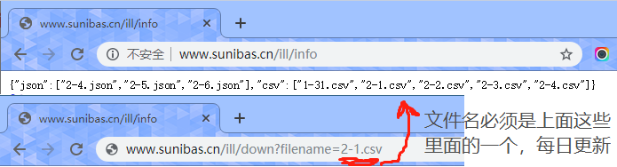
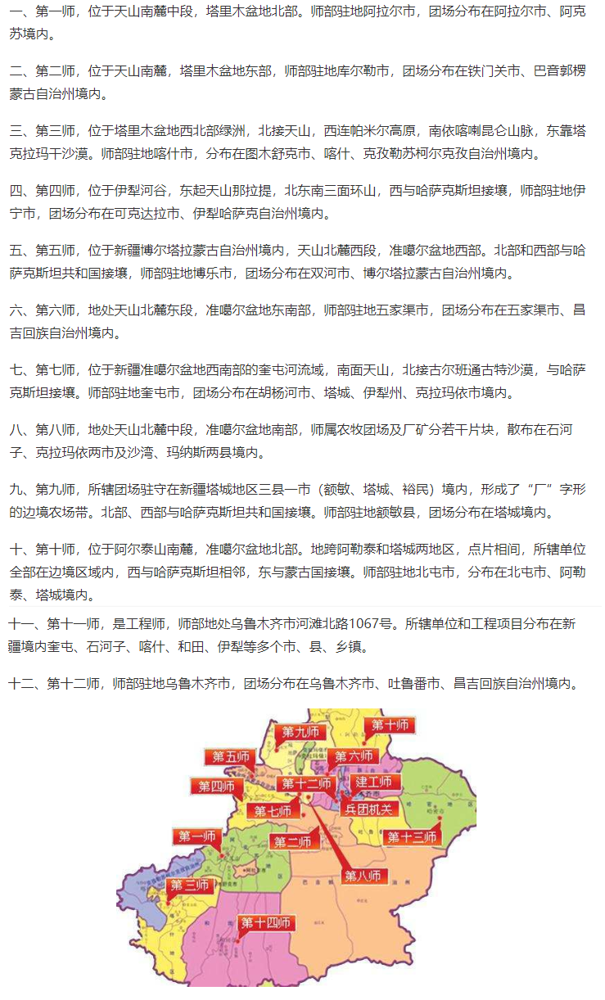

# 2019-nCoV-Datas

## 疫情每日数据记录

> 今日开始加入处理才知道数据获取很难，今后一定要及时掌握数据

> 新增两个接口 [查询数据接口](http://www.sunibas.cn/ill/info) 和 [下载接口](http://www.sunibas.cn/ill/down?filename=)



## 项目内容说明

- source 是原始数据，数据来源如下

> 其中 all.txt 是项目中的 Wuhan-2019-nCoV.csv 文件，但是根据 ISSUE 反馈，从 1-31 开始数据就出现问题，估计是爬取对象修改了接口

> csvFile 文件为项目的 DXYArea.csv 文件，爬取方式是每天定时爬取，也可以从 commits 中获取历史项目

> jsonFile 是我的服务器每日定时(每十分钟)写一个文件(mm-dd.json)进行覆盖，并每日留有最后一份。

> 个人还是不推荐用 csvFile ，理由见[处理代码](source\dearCsv.js)即可，虽然很推荐 all.txt 但是没有更新了

|数据|来源|
|:--|:--|
|all.txt|[GitHub项目：Wuhan-2019-nCoV](https://github.com/canghailan/Wuhan-2019-nCoV)|
|csvFile\所有csv|[GitHub项目：DXY-2019-nCoV-Data](https://github.com/BlankerL/DXY-2019-nCoV-Data)|
|jsonFile\所有json|百度疫情地图|

- 脚本说明

|脚本|说明|
|:--|:--|
|source\dear_all.js|用于处理 all.txt 文件|
|source\dearCsv.js|用于处理 csvFile 中的文件|
|source\dearJson.js|用于处理 jsonFile 中的文件|
|source\_json.js|用于将 datas 中的内容转换为 json 并以[行政代码]为[键]|
|getChinaChange.js|用于获取截至到目前为止最新的疫情统计数据(全国)|
|downCsv.sh|定时任务脚本，但是要自己设定，设定方式在#里|
|autoRefleshAndDear.js|自动从服务器下载和处理每日数据|

- autoRefleshAndDear.js 脚本说明

```javascript
// 因为 csv 数据是从 1-31 开始
// 而 json 数据是从 2-4 开始，存在交集
// 这部分代码我没有使用 _dcsv 因为他的数据我真觉得很难处理和收据不全
const dearFiles = () => {
    _djson(basePath,norepeat,function () {
        _json(basePath,norepeat,function () {
            console.log("完成");
        });
    })
};

// _dcsv 版本如下
const dearFiles = () => {
    _dcsv(basePath,norepeat,function () {
        _json(basePath,norepeat,function () {
            console.log("完成");
        });
    })
};

// 可以 _dcsv 和 _json 一起使用
const dearFiles = () => {
    _dcsv(basePath,norepeat,function () {
        _djson(basePath,norepeat,function () {
            _json(basePath,norepeat,function () {
                console.log("完成");
            });
        })
    })
};
```

- [行政代码](http://www.mca.gov.cn/article/sj/xzqh/2019/)

- Iwant 文件夹是我个人数据处理用到的

- 附带一些其他资料

> [AkShare](https://akshare.readthedocs.io/zh_CN/latest/index.html)

> [AkShare 事件数据](https://github.com/jindaxiang/akshare/blob/4434da3af4ea7a3a7b73d2e95b6a1a654c8f5ae3/docs/source/data/event/event.md)

> Iwant/UltraCodingSwitch.exe 因为 node 写中文会乱码，有不想额外给项目安装其他库，所以提供一个工具，以后有空我将提供一个命令行工具

- 地区说明

> 新疆的十二个师，来源于[百度知道](https://zhidao.baidu.com/question/589049747264743725.html)资料，以驻地为准，多个驻地以第一个为准

